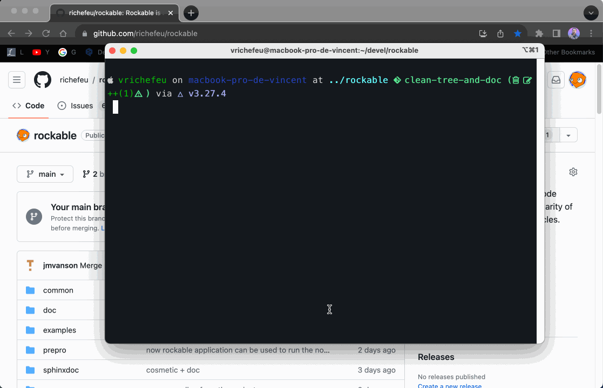
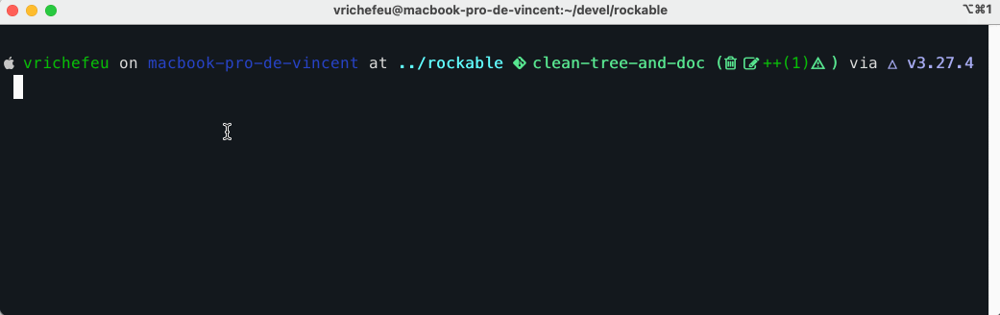
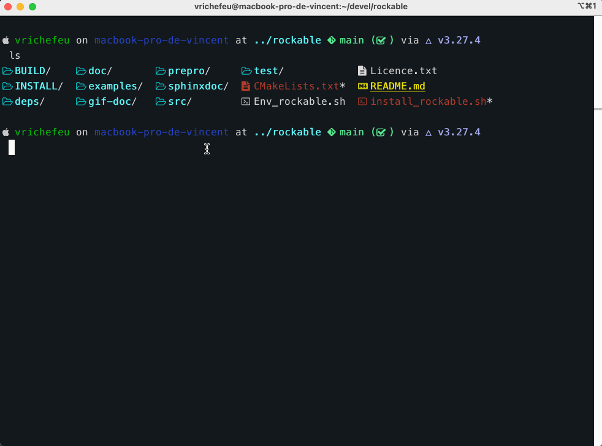

<p align="center">

</p>

## What is `Rockable`?   

Rockable is a DEM code written in C++, initiated by <vincent.richefeu@3sr-grenoble.fr>. The two main specificities of the code are (_i_) to hold sphero-polyhedral shapes, (_ii_) to manage breakable interfaces. It is developed for an **academic usage**. This means that the code is not intended to be a tool for all purposes. It can easily be used to do what it is designed for, but to extend it, it is necessary to master both the model (DEM, complex shapes and interaction laws) and its implementation (data structure). The benefit of a good understanding is to avoid a "hacking" that would eventually limit the developed possibilities. In other words, the design of the code (neither too specific nor too general) is intended to avoid any tendency towards a single thought.

The use of the code is not interfaced by any tool (like lua, python or any graphical interface) to facilitate its use, except the input format as described in the [documentation](https://richefeu.github.io/rockable/). This makes it particularly streamlined and greatly facilitates its integration with other calculation codes. It is in this sense that Rockable is qualified of "academic code".

### Source tree 

* `sphinxdoc`: user [documentation](https://richefeu.github.io/rockable/) (sphinx with ReStructuredText)
* `examples`: examples for usage tutorials or for testing features
* `prepro`: some pre-processing tools
* `src`: C++ source files
* `test`: regression test files

### Folders created at building stage

* `deps`: source files for Rockable dependencies fetched by `cmake`
* `BUILD`: compilation files of the code (created by the script `install_rockable.sh`)
* `INSTALL:` binaries of Rockable routines (created by the script `install_rockable.sh`)

## Credits

The code was initially developed by *Vincent Richefeu*, at Laboratoire 3SR, to model rockfalls and rock avalanches. This has been done through The PhD work of *Stiven Cuervo* and *Bruna Garcia*, but it actually started before in a code named ``DEMbox`` (no longer maintained).

Then, the breakable interfaces have been implemented during the PhD work of *Marta Stasiak*. A number of improvements have been added at that time thanks to intensive review with *Gael Combe*, Laboratoire 3SR.

New functionalities are being studied thanks to new collaborations of people from CEA, INRA*e* and CNRS, particularly in the context of a scientific interest group (Groupement d'Interêt Scientifique, GIS, in French).
For example, *Lhassan Amarsid* (CEA) is working on the introduction of periodic boundary conditions, and multi-processor 
computing with domain decomposition. *Farhang Radjai* and students, are introducing new breakable interfaces with energy-based criteria, and also many other novel features.

Thanks to *Raphael PRAT* (and many others), software functionalities, mainly concerning the management of intricate geometries, have been added to [ExaDEM](https://collab4exanbody.github.io/doc_exaDEM/) (MPI+GPUs), developed within the exaNBody framework.

Here is the non-exhaustive list of involved persons with their main mission: 

* **Vincent Richefeu** <vincent.richefeu@univ-grenoble-alpes.fr> (Laboratoire 3SR, UGA): initiated the project
* **Gael Combe** <gael.combe@univ-grenoble-alpes.fr> (Laboratoire 3SR, G-INP): mechanical modelling 
* **Lhassan Amarsid** <lhassan.amarsid@cea.fr> (CEA): mechanical modelling, parallel computing
* **Raphael Prat** <raphael.prat@cea.fr> (CEA): parallel computing
* **Jean-Mathieu Vanson** <jean-mathieu.vanson@cea.fr> (CEA): mechanical modelling
* **Farhang Radjai** <franck.radjai@umontpellier.fr> (LMGC, CNRS): mechanical/physical Mentor
* **Jean-Yves Delenne** <jean-yves.delenne@inrae.fr> (IATE, INRAE): mechanical/biological modelling
* **Saeid Nezamabadi** <saeid.nezamabadi@umontpellier.fr> (LMGC, UM2): Non Smooth Discrete Element Method (NS-DEM)
* **Patrick Mutabaruka** <patrick.mutabaruka@ifremer.fr> (Ifremer): coupling with Lattice Boltzmann Method (LBM)


## Features

* **Particle Shapes:** the code uses only one 3D shape: sphero-polyhedra or *R*-shapes. These shapes can be non-convex (with cavities if needed) and have rounded edges and corners (uniform radius per shape).

> [!NOTE]
> Some other shapes are currently considered for special boundary shapes (sphere, cylinder...) and specifique loadings.
	
* **Boundary Conditions**: any rigid element can be used to apply boundary conditions. It is possible to impose velocity, force, or moment component by component. Some predefined systems with servo-control are also available for complex loading conditions (e.g., loading cycles or controlled pressure).

> [!NOTE]
> The possibility of applying tri-periodic loading to an assembly is implemented and currently in the testing phase.

* **Parallel Computation**: currently, an OpenMP optimization using compilation flags has been implemented. However, the computational speedup is relatively low. Typically, 8 cores are needed to halve the simulation time (for a dense system with a large number of elements).

* **Documentation**: there is little [documentation](https://richefeu.github.io/rockable/), although efforts are being made to address this. For now, it is possible to generate the sphinxdoc documentation in your local folder.

<p align="center">

</p>

## How to install

The source code can be cloned from github repository:

```sh
git clone https://github.com/richefeu/rockable.git
```

Using your OS package manager (yum, apt, brew etc) you will maybe need to install several package before compiling: `glfw3`, `opengl`,`freeglut`, `libpng2` (optionnal).


If you are lucky, the compilation is as simple as:

```sh
sh install_rockable.sh
```
<p align="center">

</p>

The compilation is done in the `BUILD` directory and the binaries go to the `INSTALL` directory.

Then, if needed, you can manage compilation options (profiling with MATools, full fetch of dependencies, see compilation, prepro compilation etc) using ccmake:

```sh
cd BUILD
ccmake .
# Set up options then `c`, then `e`, then `g`
cmake ..
make -j
make install 
```

The options available are listed below:

* `ROCKABLE_USE_FT_CORR` (default is OFF): add objectivity correction to tangent forces.
* `ROCKABLE_ENABLE_PROFILING` (default is OFF): enable time profiling.
* `ROCKABLE_ENABLE_BOUNDARY` (default is OFF): enable the special boundaries like Ball or Cylinder.
* `ROCKABLE_ENABLE_SOFT_PARTICLES` (default is OFF): enable straining of particles.
* `ROCKABLE_ENABLE_PERIODIC` (default is OFF): enable full periodic boundary conditions.
* `ROCKABLE_COMPILE_SEE` (default is ON): compile the application to visualize the conf-files.
* `ROCKABLE_COMPILE_SEE3` (default is OFF): compile the application to edit graphically the input files
* `ROCKABLE_COMPILE_CONF2VTK` (default is OFF): compile the application to convert .conf into .vtk file to visualize results with paraview
* `ROCKABLE_COMPILE_POSTPRO` (default is OFF): compile the application for postprocessing the results
* `ROCKABLE_COMPILE_PREPRO` (default is OFF): compile the aplications to generate inputs for the code

## How to run a simulation

<p align="center">

</p>

Before runing rockable you will need to source rockable environnement to add the INSTALL directory to your standard binaries PATH:

```sh
source add_install_to_path.sh
``` 

> [!IMPORTANT]
> When you run a script, it runs in a subshell, which means any environment variables or changes to the environment,
> such as adding the INSTALL folder to the PATH, will not persist outside of the script's execution. 
> To make the  changes to the PATH persist in your current shell session, 
> you should `source` the script rather than executing it.

To run a simulation, a configuration file has to be written. The format of such a file is described in the documentation. We show here a simple example (**input.txt**) simulating a sphere bouncing on a plan.

```
Rockable 20-02-2017
t 0
tmax 0.06
dt 1e-6
interVerlet 0.01
interConf 0.01

DVerlet 0.08
dVerlet 0.02
density 0 2700
density 1 2700

forceLaw Avalanches
knContact 0 1 1e6
en2Contact 0 1 0.05
ktContact 0 1 1e7
muContact 0 1 0.4
krContact 0 1 1e7
murContact 0 1 0.0

iconf 0
nDriven 1
shapeFile SphereAndPlan.shp
Particles 2
Plan 0 0 1 0 -0.05 0 0 0 0 0 0 0 1 0 0 0 0 0 0 0 0 0
Sphere 1 0 1 -0.5 0.5 0 3.69 -3.29 0 0 0 0 0.707 0 0.707 0 0 0 -50.52 0 0 0
```

The shape-file is a file named **SphereAndPlan.shp** with the following content:

```
<
name Plan
radius 0.05
preCompDone y
nv 4
2 0 0.5
2 0 -0.5
-2 0 -0.5
-2 0 0.5
ne 4
0 1
1 2
2 3
3 0
nf 1
4 0 1 2 3
obb.extent 2.0 0.05 0.5
obb.e1 1 0 0
obb.e2 0 1 0
obb.e3 0 0 1
obb.center 0 0 0
volume 1
I/m 1 1 1
>

<
name Sphere
radius 0.08
preCompDone y
nv 1
0 0 0
ne 0
nf 0
obb.extent 1 1 1
obb.e1 1 0 0
obb.e2 0 1 0
obb.e3 0 0 1
obb.center 0 0 0
volume 0.004021
I/m 0.00493333 0.00493333 0.0032
```

Then you can launch Rockable using:

```
rockable input.txt
```

If the executable has been compiled with openMP libraries, you can set the number of threads with the option `-j`:

```
rockable -j 8 input.txt
```

The verbosity of logs can be managed:

```
rockable -v 6 input.txt 
```

Highest number corresponds highest verbosity. `6: trace`, `5: debug`, `4: warn`, `3: warn`, `2: err`, `1: critical`, `0: off`

If the files produced by a computation (conf*, kineticEnergy.txt, perf.txt, and staticBalance.txt) have to be deleted, rockable can do the job.

```
rockable -c
```

## Visualising the simulations

Normally, the application `see` has been built at the same time than rockable:

```
see conf100
```

If compiled the application `see3` is also available:

```
see3 conf100
```

It allows to edit confs interactively.
