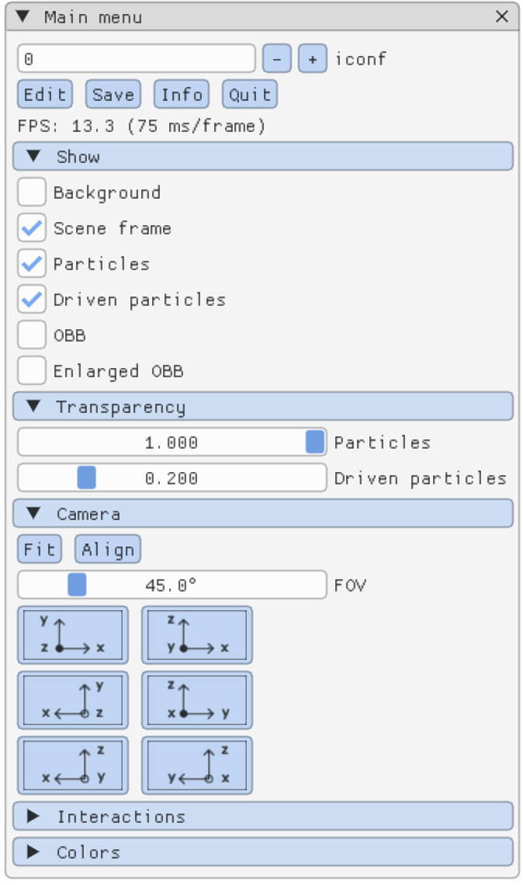
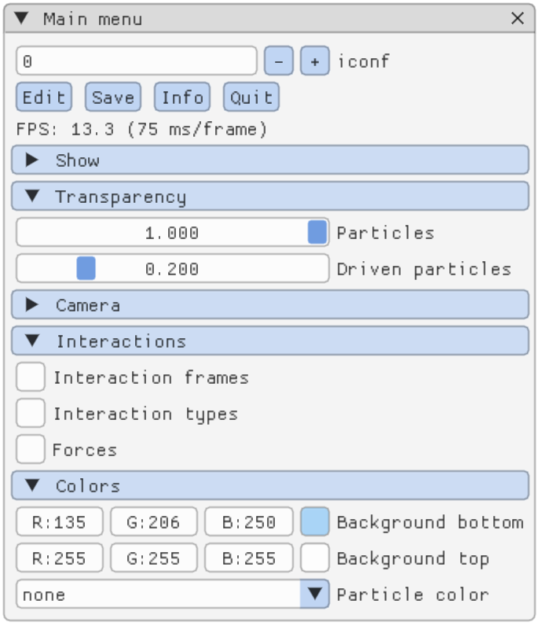
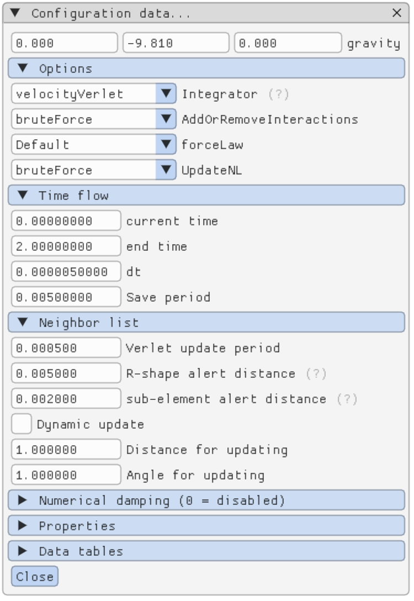
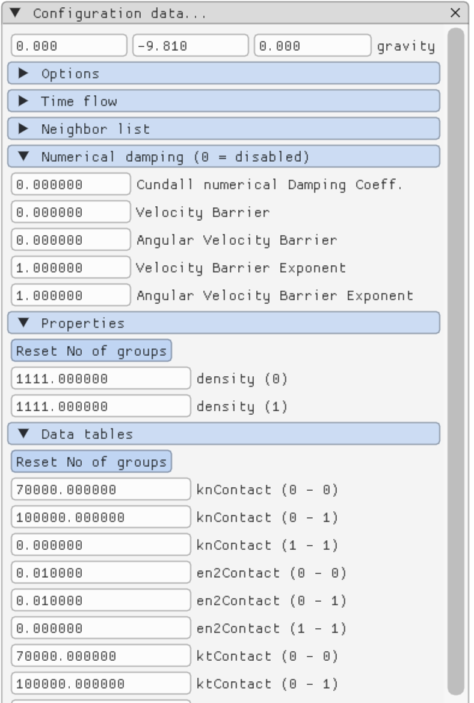
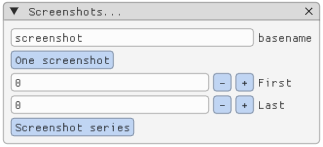
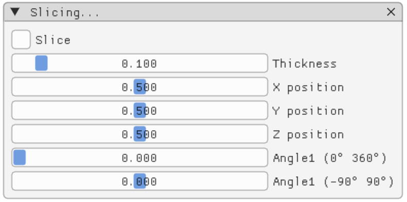

## What is `Dear My Seer`?

**Dear My Seer** is the visualization application that replaces `see` in `Rockable`. 
The old `see` application used `freeglut` and thus **X11**, which made maintenance difficult, especially on Apple computers. The console-name `seer` stands for **see-rockable**, and since this new version uses **Dear ImGui**, it has been named **Dear My Seer** as a playful wordplay.

If you were using `see`, you will only need to slightly change your habits by adding an **"`r`"** at the end of `see`.

Thanks to **Dear ImGui**, many features are now accessible through a modern and intuitive interface, using the mouse for a smoother experience.

**Dear My Seer** is based on **Rockable**'s input format, meaning it can be used with other DEM applications. All you need to do is provide the configuration file (conf-file) in the correct format (this is what **ExaDEM** already does).

## Control panel

## Configuration

## Particle selection

When you open the **Information Panel**, the displayed details will vary based on your selection:

- If **no particle is selected**, you will get general information about the sample.
- If **a particle is selected**, you will get specific details about that particle.

### How to select or unselect a particle

- **To select a particle**: hold down the **Ctrl** key and left-click on the particle.
- **To unselect a particle**: hold down the **Ctrl** key and left-click in an empty area where no particles are present.

## Screenshots

## Slice

